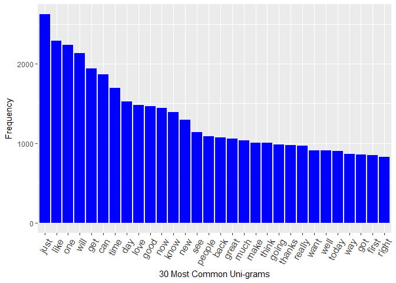
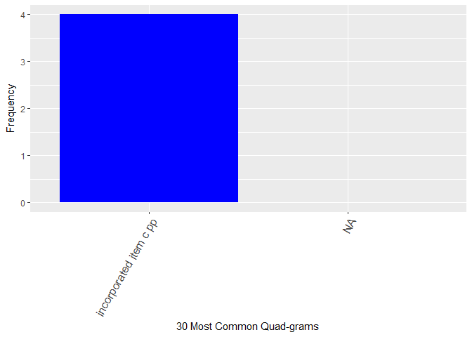

# Milestone Report
Seher F  
January 8, 2018  


## Introduction

This is the Milestone Report for the Coursera Data Science Capstone project. The goal of the capstone project is to create a predictive text model using a large text corpus of documents as training data. Natural language processing techniques will be used to perform the analysis and build the predictive model.

This milestone report describes the major features of the training data with our exploratory data analysis and summarizes our plans for creating the predictive model.

## Data Processing


### Getting data


```r
# loading some packages
library(RWekajars)
library(qdapDictionaries)
library(qdapRegex)
library(qdapTools)
library(RColorBrewer)
library(qdap)
library(NLP)
library(tm)
library(SnowballC)
library(slam)
library(RWeka)
library(rJava)
library(wordcloud)
library(stringr)
library(DT)
library(stringi)
library(googleVis)
library(ggplot2)


# setting the working directory
setwd("C:/Users/s.fazlioglu/Dropbox/Coursera/Course10_capstones")
```


```r
# Loading the data
if (!file.exists("Coursera-SwiftKey.zip")){
        download.file("https://d396qusza40orc.cloudfront.net/dsscapstone/dataset/Coursera-SwiftKey.zip", 
                      "Coursera-SwiftKey.zip")
}
unzip("Coursera-SwiftKey.zip")
```

After unzipping the file, we can take a look into the folders:


```r
list.files('final')
```

```
## [1] "de_DE" "en_US" "fi_FI" "ru_RU"
```


```r
list.files('final/en_US/')
```

```
## [1] "en_US.blogs.txt"   "en_US.news.txt"    "en_US.twitter.txt"
```


We will only be insterested in three files under the en_US folder and load the data into R:


```r
path <- file.path("./final" , "en_US")
files<-list.files(path, recursive=TRUE)
# Lets make a file connection of the twitter data set
con <- file("./final/en_US/en_US.twitter.txt", "r") 
#lineTwitter<-readLines(con,encoding = "UTF-8", skipNul = TRUE)
lineTwitter<-readLines(con, skipNul = TRUE)
# Close the connection handle when you are done
close(con)
# Lets make a file connection of the blog data set
con <- file("./final/en_US/en_US.blogs.txt", "r") 
#lineBlogs<-readLines(con,encoding = "UTF-8", skipNul = TRUE)
lineBlogs<-readLines(con, skipNul = TRUE)
# Close the connection handle when you are done
close(con)
# Lets make a file connection of the news data set
con <- file("./final/en_US/en_US.news.txt", "r") 
#lineNews<-readLines(con,encoding = "UTF-8", skipNul = TRUE)
lineNews<-readLines(con, skipNul = TRUE)
```

```
## Warning in readLines(con, skipNul = TRUE): incomplete final line found on
## './final/en_US/en_US.news.txt'
```

```r
# Close the connection handle when you are done
close(con)
```

We examined the data sets and summarize our findings (file sizes, line counts, word counts, and mean words per line) below.


```r
# Get file sizes
lineBlogs.size <- file.info("./final/en_US/en_US.blogs.txt")$size / 1024 ^ 2
lineNews.size <- file.info("./final/en_US/en_US.news.txt")$size / 1024 ^ 2
lineTwitter.size <- file.info("./final/en_US/en_US.twitter.txt")$size / 1024 ^ 2

# Get words in files
lineBlogs.words <- stri_count_words(lineBlogs)
lineNews.words <- stri_count_words(lineNews)
lineTwitter.words <- stri_count_words(lineTwitter)

# Summary of the data sets
data.frame(source = c("blogs", "news", "twitter"),
           file.size.MB = c(lineBlogs.size, lineNews.size, lineTwitter.size),
           num.lines = c(length(lineBlogs), length(lineNews), length(lineTwitter)),
           num.words = c(sum(lineBlogs.words), sum(lineNews.words), sum(lineTwitter.words)),
           mean.num.words = c(mean(lineBlogs.words), mean(lineNews.words), mean(lineTwitter.words)),
           max_lines = c(max(nchar(lineBlogs)),max(nchar(lineNews)),max(nchar(lineTwitter)))
           )
```

```
##    source file.size.MB num.lines num.words mean.num.words max_lines
## 1   blogs     200.4242    899288  38154238       42.42716     40835
## 2    news     196.2775     77259   2693898       34.86840      5760
## 3 twitter     159.3641   2360148  30218166       12.80350       213
```

Some remarks on the data: Each file has more tha 150 MB anf the number of words are more than 30 million per file. For instance, twitter has more lines with fewer words per line as expected while news are the tedt file with more longer paragraphs. Blogs are the text file with sentences and has the longest line with 40,833 characters.

### Cleaning the data

The first step is to clean the data before exploring it. This involves removing URLs, special characters, punctuations, numbers, excess whitespace, stopwords, and changing the text to lower case. Since the data sets are quite large, we will randomly choose 1% of the data to demonstrate the data cleaning and exploratory analysis also please take care of the UTF chars.


```r
# Sample the data
set.seed(5000)
sample.size=0.01
data.sample <- c(sample(lineBlogs, length(lineBlogs) * sample.size),
                 sample(lineNews, length(lineNews) * sample.size),
                 sample(lineTwitter, length(lineTwitter) * sample.size))


# Create corpus and clean the data
corpus <- VCorpus(VectorSource(data.sample))
toSpace <- content_transformer(function(x, pattern) gsub(pattern, " ", x))
corpus <- tm_map(corpus, toSpace, "(f|ht)tp(s?)://(.*)[.][a-z]+")
corpus <- tm_map(corpus, toSpace, "@[^\\s]+")
corpus <- tm_map(corpus, tolower)
corpus <- tm_map(corpus, removeWords, stopwords("en"))
# Removing Profanity Words
profanityWords = readLines('./profanity_words.txt')
corpus <- tm_map(corpus,removeWords, profanityWords)

corpus <- tm_map(corpus, removePunctuation)
corpus <- tm_map(corpus, removeNumbers)
corpus <- tm_map(corpus, stripWhitespace)
corpus <- tm_map(corpus, PlainTextDocument)
```

## Memory management

The way R Studio handles with memory is not efficient. We use the function developed by Petr Pikal and David Hinds to manage the memory.


```r
# Function developed by by Petr Pikal and David Hinds to list memories for the objects
# improved list of objects
.ls.objects <- function (pos = 1, pattern, order.by,
                        decreasing=FALSE, head=FALSE, n=5) {
    napply <- function(names, fn) sapply(names, function(x)
                                         fn(get(x, pos = pos)))
    names <- ls(pos = pos, pattern = pattern)
    obj.class <- napply(names, function(x) as.character(class(x))[1])
    obj.mode <- napply(names, mode)
    obj.type <- ifelse(is.na(obj.class), obj.mode, obj.class)
    obj.size <- napply(names, object.size)
    obj.dim <- t(napply(names, function(x)
                        as.numeric(dim(x))[1:2]))
    vec <- is.na(obj.dim)[, 1] & (obj.type != "function")
    obj.dim[vec, 1] <- napply(names, length)[vec]
    out <- data.frame(obj.type, obj.size, obj.dim)
    names(out) <- c("Type", "Size", "Rows", "Columns")
    if (!missing(order.by))
        out <- out[order(out[[order.by]], decreasing=decreasing), ]
    if (head)
        out <- head(out, n)
    out
}
# shorthand
lsos <- function(..., n=10) {
    .ls.objects(..., order.by="Size", decreasing=TRUE, head=TRUE, n=n)
}
```

And below, we use this function to manage the memory.


## Exploratory Analysis

It would be interesting and helpful to find the most frequently occurring words in the data. Here we list the most common (n-grams) bi-grams, and tri-grams.


```r
##annotate
options(mc.cores=1)
# we'll get the frequencies of the word
getFreq <- function(tdm) {
  freq <- sort(rowSums(as.matrix(tdm)), decreasing = TRUE)
  return(data.frame(word = names(freq), freq = freq))
}
unigram<-function(x) NGramTokenizer(x, Weka_control(min = 1, max = 1))
bigram <- function(x) NGramTokenizer(x, Weka_control(min = 2, max = 2))
trigram <- function(x) NGramTokenizer(x, Weka_control(min = 3, max = 3))
quadgram<- function(x) NGramTokenizer(x, Weka_control(min = 4, max = 4))
makePlot <- function(data, label) {
  ggplot(data[1:30,], aes(reorder(word, -freq), freq)) +
         labs(x = label, y = "Frequency") +
         theme(axis.text.x = element_text(angle = 60, size = 12, hjust = 1)) +
         geom_bar(stat = "identity", fill = I("blue"))
}

# Cleaning the memory to proceed further
rm(data.sample,lineBlogs,lineNews,lineTwitter,lineBlogs.words,lineNews.words,lineTwitter.words)
```


```r
# Get frequencies of most common n-grams in data sample
freq1 <- getFreq(removeSparseTerms(TermDocumentMatrix(corpus, control = list(tokenize = unigram)), 0.9999))
freq2 <- getFreq(removeSparseTerms(TermDocumentMatrix(corpus, control = list(tokenize = bigram)), 0.9999))
freq3 <- getFreq(removeSparseTerms(TermDocumentMatrix(corpus, control = list(tokenize = trigram)), 0.9999))
freq4<-getFreq(removeSparseTerms(TermDocumentMatrix(corpus, control = list(tokenize = quadgram)), 0.9999))
```

Here is a histogram of the 30 most common bigrams in the data sample.

```r
makePlot(freq1, "30 Most Common Uni-grams")
```

<!-- -->

Here is a histogram of the 30 most common bigrams in the data sample.

```r
makePlot(freq2, "30 Most Common Bi-grams")
```

<!-- -->

Here is a histogram of the 30 most common trigrams in the data sample.


```r
makePlot(freq3, "30 Most Common Tri-grams")
```

<!-- -->

Here is a histogram of the 30 most common bigrams in the data sample.

```r
makePlot(freq4, "30 Most Common Quad-grams")
```

```
## Warning: Removed 29 rows containing missing values (position_stack).
```

<!-- -->


##Conclusion and further planning

This concludes our exploratory analysis. The next steps of this capstone project would be to finalize our predictive algorithm, and deploy our algorithm as a Shiny app.

Our predictive algorithm will be using n-gram model with frequency lookup similar to our exploratory analysis above. One possible strategy would be to use the trigram model to predict the next word. If no matching trigram can be found, then the algorithm would back off to the bigram model, and then to the unigram model if needed.

The user interface of the Shiny app will consist of a text input box that will allow a user to enter a phrase. Then the app will use our algorithm to suggest the most likely next word after a short delay.


```r
# Stop the clock (in seconds)
proc.time() - ptm
```

```
##    user  system elapsed 
##  536.85   10.53  618.03
```


